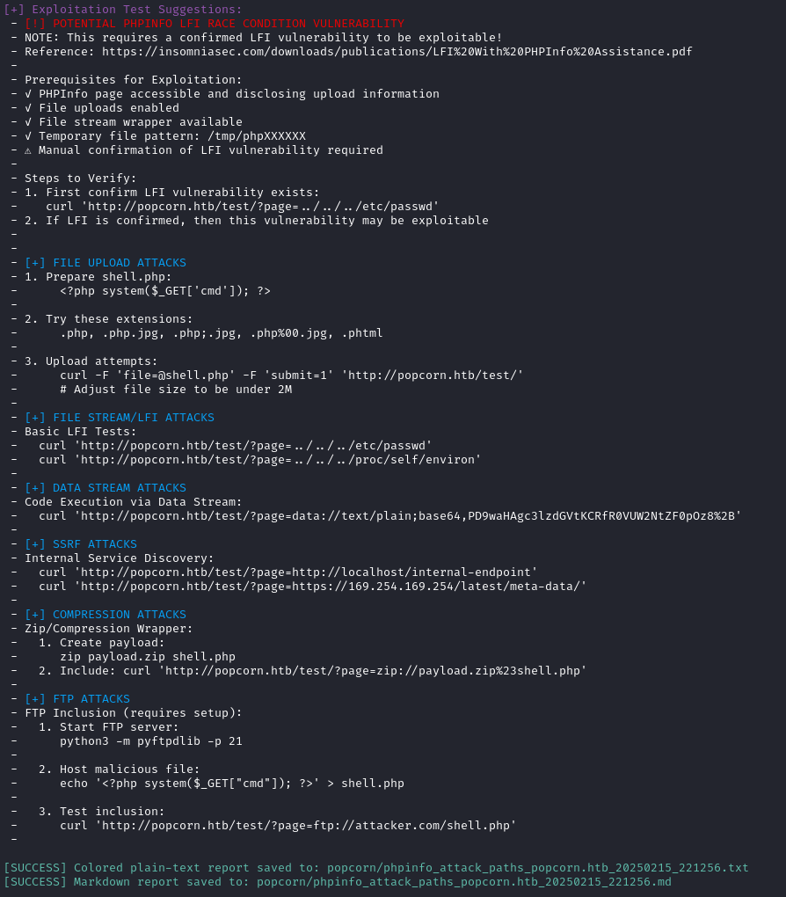

# PHPInfo Attack Path Analyzer

The **PHPInfo Attack Analyzer** is a **penetration testing tool** that extracts, analyzes, and exploits security misconfigurations from **phpinfo()** pages. This tool is designed for **OSCP, OSWE, and bug bounty hunters** looking to automate the process of identifying **attack paths** in web applications that expose `phpinfo()` output.

## Features

- **PHPInfo Parsing**: Extracts key PHP configuration settings, OS/server details, registered streams, and file upload parameters.
- **Attack Path Identification**: Highlights dangerous configurations (e.g., `allow_url_include`, `open_basedir` misconfigurations).
- **Exploitation Suggestions**: Provides concrete test cases (e.g., LFI/RFI payloads, command injection examples).
- **Dual Output**:
  - Colorized plain-text report for terminal viewing.
  - Markdown report for documentation/sharing.
- **Version Checks**: Flags known vulnerable PHP versions and 
suggests related CVEs.


## 📥 Installation & Setup

### **1. Clone the repository & install dependencies**
```bash
git clone https://github.com/ghostresonance/phpinfo-attack-analyzer.git
cd phpinfo-attack-analyzer
pip install -r requirements.txt
```

### **2. Run the tool**
```bash
python phpinfo_attack_paths.py --url <target_url> --outdir <output_directory>
```
### Screenshots



